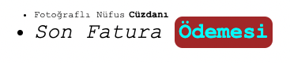
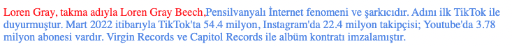
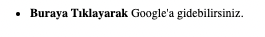
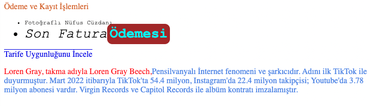

# Css Kodları

-   Kalın yazmak için:
    ```css
    font-weight: bold;
    ```
-   İtalik yazmak için:
    ```css
    font-style: italic;
    ```
-   Font tipi değiştirmek için:
    ```css
    font-family: Arial, sans-serif;
    ```
-   Font büyüklüğü değiştirmek için:
    ```css
    font-size: 16px;
    ````
-   Altı çizili yazmak için:
    ```css
    text-decoration: underline;
    ````
-   Üstlü çizili yazmak için:
    ```css
    text-decoration: overline;
    ````
-   Yazı tipi rengi değiştirmek için:
    ```css
    color: red;
    ````
-   Dolgu rengi değiştirmek için:
    ```css
    background-color: yellow;
    ````
-   Hizalama değiştirmek için:
    ```css
    text-align: center;
    ````
-   Paragraf İmleri değiştirmek için:
    ```css
    list-style-type: square;
    ```

# Html Tagler

-   'a' (anchor) etiketi, bir web sayfasındaki metin veya resimlere bağlantı eklemek için kullanılır. Örneğin, başka bir web sayfasına veya e-posta adresine giden bir bağlantı oluşturmak için kullanılabilir.
    ```html
    <a href="https://www.example.com">Example</a>
    ```
-   'span' etiketi, belirli bir metnin içerisinde bir bölümünün stilini değiştirmek için kullanılır. Bu etiket, genellikle bir paragraf içinde tek bir kelime veya cümleyi etkilemek için kullanılır.
    ```html
    <p>This is a <span style="color: red">example</span> text.</p>
    ```
-   'ul' (unordered list) ve 'ol' (ordered list) etiketleri, listeler oluşturmak için kullanılır. 'ul' etiketi maddeler arasında noktalı liste oluştururken, 'ol' etiketi maddeler arasında numaralı liste oluşturur.
    ```html    
    <ul>
        <li>Item 1</li>
        <li>Item 2</li>
        <li>Item 3</li>
    </ul>

    <ol>
        <li>Item 1</li>
        <li>Item 2</li>
        <li>Item 3</li>
    </ol>
    ```
-   'p' (paragraph) etiketi, paragraf oluşturmak için kullanılır. Bu etiket, genellikle metin bloğunun bir bölümünü oluşturmak için kullanılır.
    ```html
    <p>This is a paragraph.</p>
    ```

**Not:** Bu taglare inline css tanımlaması yapılabilir. Aşağıdaki örnekte gösterildiği gibi eklenmektedir.
```html
<a href="https://www.example.com" style="color: red; text-decoration: none;">Example</a>
```

# Kurallar

-   İki yazıyı yan yana konulması isteniyor ise;
    ```html
    <span>
        <span>Ödeme ve</span>
        <span>Kayıt</span>
    </span>
    ```
-   İki yazıyı alt alta koymak ve ortalamak için;
    ```html
    <span style="text-align:center;">Ödeme ve</span>
    <span style="text-align:center;">Kayıt</span>
    ```
-   Liste yapısında herhangi bir yeri özelleştirmek;

    **Kod:**

    ```html
    <ul style="font-family: 'Courier New', Courier, monospace;">
        <li style="font-size: 12px;"><span>Fotoğraflı Nüfus</span><span style="font-weight: bold;">Cüzdanı</span></li>
        <li style="font-size: 27px;">
            <span style="font-style: italic;">Son Fatura</span>
            <span style="font-weight: bold; color:aqua; border-radius: 10px; background-color: brown;padding: 5px;">Ödemesi</span>
        </li>
    </ul>
    ```

    **Çıktı:**  

     

-   İnline css kodları aralarında **';'** konulması gerekmektedir.Eğer konulmaz ise css gösterilmeyecektir.
    ```html
    <span style="font-style: italic;">Son Fatura</span>
    <span style="font-weight: bold; color:aqua; border-radius: 10px; background-color: brown;padding: 5px;">Ödemesi</span>
    ```
-   **'p'** etiketi herzaman yeni bir obje sayılır içerisine yazılan herşey yeni bir satırda yan yana konulacaktır. İçerisinde özelleştirilmeler yapılabilmektedir.

    **Kod:**

    ```html
    <p style="font-size: 16px; color:cornflowerblue;">
        <span style="color:red;">
            Loren Gray, takma adıyla Loren Gray Beech,
        </span>
        <span>
            Pensilvanyalı İnternet fenomeni ve şarkıcıdır. Adını ilk TikTok ile duyurmuştur. Mart 2022 itibarıyla TikTok'ta 54.4 milyon, Instagram'da 22.4 milyon takipçisi; Youtube'da 3.78 milyon abonesi vardır. Virgin Records ve Capitol Records ile albüm kontratı imzalamıştır.
        </span>
    </p>
    ```
     
    **Çıktı:**  

        
    

# Notlar
-   Etiket derinliği maximum 4 dür. Daha fazlasını tanımlamayacaktır.
    ```html
    <ul >
        <li style="font-size: 12px;">
            <span>
                <a href="#">Buraya</a>Tıklayarak
            </span>
            <span>Google'a gidebilirsiniz.</span>
        </li>
    </ul>
    ```
-   Etiketlerin içinde özelleştirme yapılmak istendiğinde etiketin içerisine spanlar konulmalıdır ve boşta yazı kalmamalıdır. Aşağıdaki yanlış kullanımdır. 

    **Kod:**  

    ```html
    <ul >
        <li style="font-size: 12px;">
            <span style="font-weight: bold;">
               Buraya Tıklayarak
            </span>
            Google'a gidebilirsiniz.
        </li>
    </ul>
    ```
    **Çıktı:**  

      

    Eğer bu şekilde yazılır ise ilk başta **'Google' a girbilirsiniz. Buraya Tıklayarak'** şeklinde çıktı verecektir.Doğru kullanımı ise boşta kalan kısmında ayrı spana almaktır. Doğru kullanımı ise aşağıda yer almaktadır. 

    **Kod:**  

    ```html
    <ul >
        <li style="font-size: 12px;">
            <span style="font-weight: bold;">
               Buraya Tıklayarak
            </span>
            <span>
                Google'a gidebilirsiniz.
            </span>
        </li>
    </ul>
    ```

    **Çıktı:**  

    

# Örnek Kullanım

**Kod:**

```html
<span style="color:chocolate;text-align:center;font-size: 16px;">
    Ödeme ve Kayıt
</span>
<span style="color:chocolate;text-align:center;font-size: 16px;">
    İşlemleri
</span>
<ul style="font-family: 'Courier New', Courier, monospace;">
    <li style="font-size: 12px;">Fotoğraflı Nüfus Cüzdanı</li>
    <li style="font-size: 27px;">
        <span style="font-style: italic;">
            Son Fatura
        </span>
        <span style="font-weight: bold; color:aqua; border-radius: 10px; background-color: brown;padding: 5px;">
            Ödemesi
        </span>
    </li>
</ul>
<a href="www.google.com" style="text-decoration: overline;">
    Tarife Uygunluğunu İncele
</a>
<p style="font-size: 16px; color:cornflowerblue;">
    <span style="color:red;">
        Loren Gray, takma adıyla Loren Gray Beech,
    </span>
    <span>
        Pensilvanyalı İnternet fenomeni ve şarkıcıdır. Adını ilk TikTok ile duyurmuştur. Mart 2022 itibarıyla TikTok'ta 54.4 milyon, Instagram'da 22.4 milyon takipçisi; Youtube'da 3.78 milyon abonesi vardır. Virgin Records ve Capitol Records ile albüm kontratı imzalamıştır.
    </span>
</p>
```
**Çıktı:**

<p style="margin-top:20px;">
  
</p>
